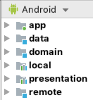

# eSocial

* The current state of the project is __INCOMPLETE__. The `app` module only has a "preview" screen for "source" selection which isn't production ready code.

This demo app has the purpose of demonstrating knowledge over Android Development.

It is about to fetch social posts and display it to the user, but currently only integrates a single source: [JSONPlaceholder](http://jsonplaceholder.typicode.com/)

* The idea is to try to integrate a second source in a later stage to check how this architecture manages those changes.

Tried to follow a Clean Architecture as described by [Robert C. Martin - Uncle Bob](https://twitter.com/unclebobmartin) in his [blog](https://blog.cleancoder.com/uncle-bob/2012/08/13/the-clean-architecture.html).

The project have different modules:

* __domain__ contains the `use cases` and the domain `models`, along with some `interfaces` defining the `repository` and `executor`. 
* __data__ held `interfaces` for the `data store` (interface for repository) and `data source` (interface for the source of data). Also contains an implementation of the `data repository` to be used in the above layers.
* __local__ `data source` implementation for a local source of data, storing using `Room` (which other modules should not be aware of, with the exception of the [Note1](#note1))
* __remote__ `data source` implementation for the remote source of data, using `Retrofit` to execute HTTP requests, this currently implements the `JSONPlaceholder` source.
* __presentation__ responsible for managing the `state` of the views, contains the `ViewModel` implementations where will execute the `use cases` from domain and manage the `data` (to store, retrieve, etc.), signalling through the `state` of the `ViewModel` to the upper layers.
* __app__ consumer and "glue" of everything, will provide the DI required for each layer (using `Koin`), it is a mobile representation of `UI` (one of as many it could have - for example, another representation for TVs, another for Wearables, etc.). Here is the layer where the make the interaction with the user and manage it, through the `ViewModel`s, the state of the application storing/retrieving data when required.

The `models` was applied as much as possible the Clean Architecture way, where each module have their own `model` representation with the required `mappers` between them (the "exception" is `app` module where "reuse" the `presentation`'s model)

It is understandable the approaches used here are an educational and "demoable" purpose, and in a real application some layers/representation can be "merged" together - as an example often implementation merges the `app` with the `presentation`.

Tried as much to use TDD as possible, I believe the coverage of the project is high, I did not generate the report, yet!

# Libraries
* TODO 

# Credits

Across some months I've been reading and checking loads of materials and references on architectures, patterns, etc.
Usually, I check contents offered from the community and posted by users in:
* androiddevbr.slack.com
* android-united.slack.com
* kotlinlang.slack.com

But the __main__ material used for this particular project was the [course](https://caster.io/courses/android-clean-architecture) at [caster.io](https://caster.io/) offered by [Joe Birch](https://joebirch.co/).
* I have a different style and approaches from what was practised in the course, where I applied in this project, for example, the `mappers` are totally different approach, some abstractions and extensions were used, the DI library - wherein the course was used `Dagger` I preferred to adventure in `Koin` where was new for me. For tests, I prefer the use of `MockK` (more affinity and personal choice) than used in the course `Mockito`.

## <a name="note1"/>Note1
The way I manage the "Factory" in the `local` module for the `Room`, expose the use of it on outside layers, so had to add the `Room` dependency on the `app` module, which it shouldn't know about it.

It requires some refactor where I'm planning to do it. 